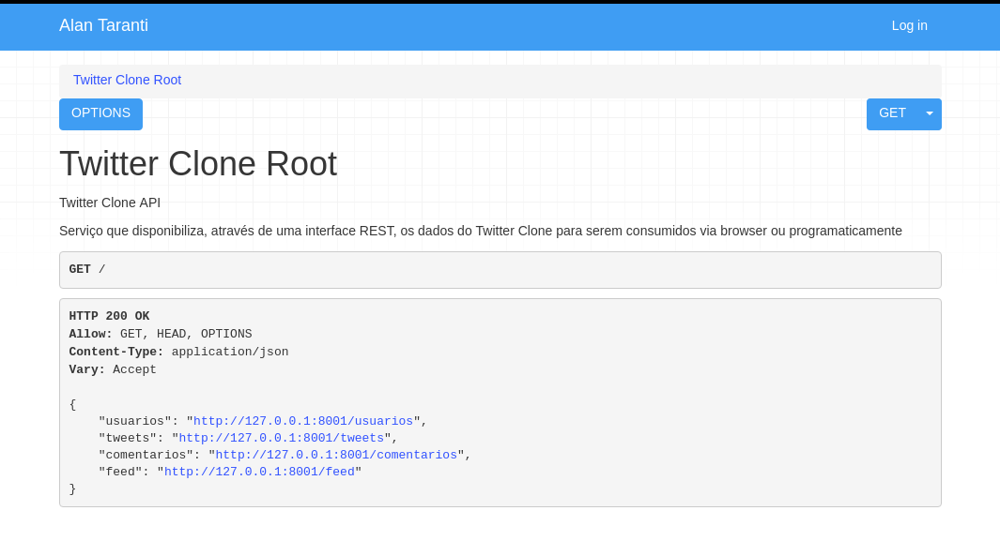

# Twitter Clone API

### O que é esse o projeto?

É um serviço que disponibiliza, através de uma interface REST, os dados do Twitter Clone para serem consumidos via browser ou programaticamente

### Como inicializar o projeto?

1. Primeiramente, tenha certeza que você tenhas os requisitos abaixos atendidos:
- Git
- Python 3.6+
- Windows, Linux ou Mac

2. Clone o projeto:

    `$ git clone https://github.com/AlanTaranti/twitter_clone_api`

3. Pelo terminal, entre no diretório clonado e instale as dependências do projeto:

	`$ pip install -r requirements.txt`
	
4. Inicialize o banco de dados SQLite:
    
    `$ python manage.py migrate` 

5. Execute o servidor:
    
    `$ python manage.py runserver` 

A sequência acima, só precisa ser executada uma única vez.

Sempre que quiser iniciar o projeto, basta executar o passo 5.

### Quais os recursos dessa API?

Ela serve basicamente para você manipular usuários, tweets e comentários.

A API fornece duas formas de consumo de dados:
- Via browser: para melhor compreensão da ferramenta.
- Programaticamente: para maior flexibilidade no uso da ferramenta.

### Cadê a documentação da API?

A documentação fica na própria API, basta você acessar ela via browser.

Cada endpoint possui sua própria documentação.

## Como eu entro em contato?
* Email: [alan.taranti@gmail.com](mailto:alan.taranti@gmail.com)
* Website: <a href="http://alantaranti.github.io" target="_blank">alantaranti.github.io</a>
